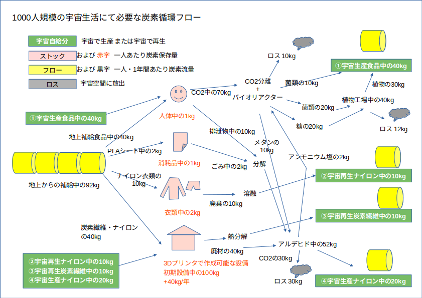
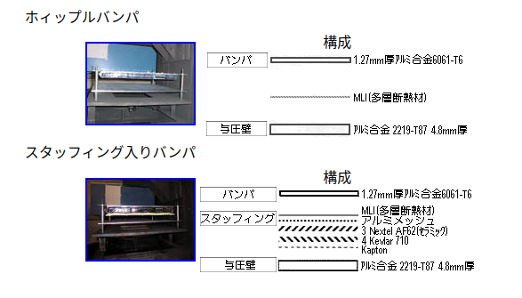
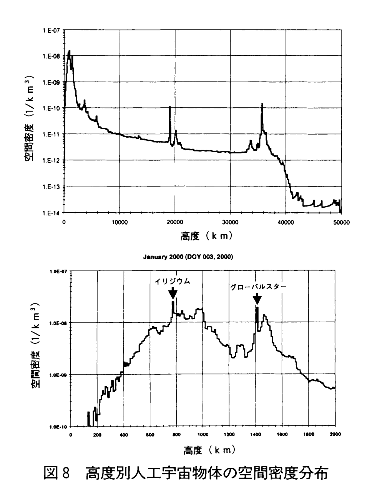
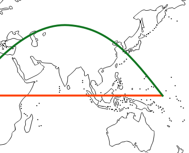
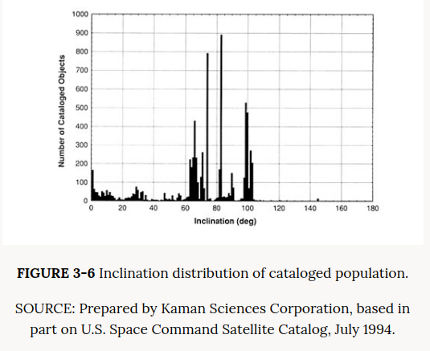
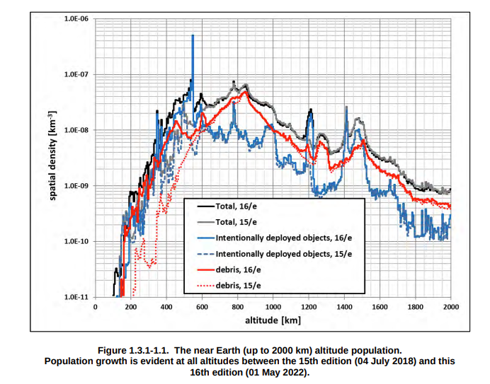

# アブストラクション

宇宙農業を行うには、ISS などよりも数十倍以上のサイズの宇宙設備が必要となる。断面積も数十倍以上となり、デブリのヒットによる影響が甚大となる。本稿では、宇宙農場におけるデブリの確率の計算、および妥当な対策について述べる。

# 想定

宇宙での生活人口が100人超えた頃から自給体制を作る必要が出てくる。更に1000人規模で自給が軌道に乗った頃を想定すると、生活に必要な炭素の半分を再利用分で賄うぐらいで想定する。

この中で、食料を宇宙農業で賄うことは必須である。
例えば人間一人あたり断面積1000m^2が必要となり、ISS並の防御をしたとしても1年に1回は貫通ヒットが発生することに鳴る。
さて宇宙食料生産の話しの続き。 1000人分とすると 1.1平方km と 330kLとなります。
食物工場を軌道上で作るとなると、どういった施設が必要か? 最初の考察として、 ISSモジュールと同じもので作ると考えてみます。ISS は雑多なモジュールで構成されていますが、そのうちの「きぼう」で考えます。「きぼう」は6つの要素がありますが、そのうちのストレージの役割を持つ船内保管室と同じように作るとします。「きぼう」の船内保管室は 直径、全長共に4.2m の円筒形、質量は4.2トン。これと同じ大きさで農場モジュールを作るとして、内部に同心円筒状にジャガイモ育成パレットを3段並べて 100m^2 としLEDで照明、中心に30リットルの酵母培養槽。パレットや培養槽、栽培マシン、水、作物などの質量を農場モジュール1つあたり10トンとすると、1人あたり農場モジュールは10基。
1000人分だと農場モジュールが1万基必要。相当な数量ですね。
ちなみに「きぼう」船内保管室 のデブリ対策は厚み約10cmの シールド・バンパー・与圧壁で構成されているそうです。

Wikipedia の数字などからざっと計算すると、10年間軌道上で運用した場合のデブリやメテオロイドによる貫通確率は1%以下ぐらいになりそうです。
これを1万基とすると1年間に100基は貫通されてしまいそうです。しかしながら衝突面の方向は偏りがあるために、そちらに向けて配列などを工夫すれば例えば 衝突面 に質量シールドを展開、その影に10基カスケードに配置する工夫をするとなると衝突確率は1/10 に。いろんな工夫ができそうです。
# 軌道高度
まずは高度によるデブリの密度。https://www.jstage.jst.go.jp/article/sicejl1962/41/8/41_8_551/_pdf
画像

# デブリ密度

上は2002年のデータかな? 数は10cm以上のデブリについてなのですが、それより小さな大きさのデブリは相当数が増えそうです。英語版Wikipedia 2024・6・9時点の記述では、

Size and numbers
As of January 2019 there were estimated to be over 128 million pieces of debris smaller than 1 cm (0.39 in), and approximately 900,000 pieces between 1 and 10 cm. The count of large debris (defined as 10 cm across or larger[44]) was 34,000 in 2019,[8] and at least 37,000 by June 2023.[45] The technical measurement cut-off[clarification needed] is c. 3 mm (0.12 in).[46]

https://en.wikipedia.org/wiki/Space_debris

とあります。
大体、直径サイズ1/2ごとに10倍に増えるぐらいでしょうか。
# デブリ防御

例えばニューナンブの拳銃弾の初速が 0.2km/s 程度、ライフル弾が少口径高速弾と言われる 5.56mm NATO弾で0.9km/s 、チート級APFSDSである3BM69 でも2km/s 程度ですからいかに5km/s とか 10km/s とかが脅威になるかがわかるでしょう。
ここで10km/s のデブリへの防御を考えてみます。この程度だと運動エネルギーによって衝突体・被衝突体ともに接触した箇所は流体となります。なのでデブリに対しての装甲はモース硬度とか一切関係なくなり、反発係数 e=0 とした作用反作用の運動方程式を解くことになります。 

実は簡単な方程式を解くと、速10km/s 程度だと衝突時に接触面は流体としてふるまうため、装甲は硬度などはあまり関係なくなり質量による防護が卓越する。運動方程式を解くとこのような状態ではデブリの速度は侵徹深さにはあまり関係がなくなり、デブリの奥行きと密度に依存することになる。例えばデブリの奥行きが1cm として、同じ密度の装甲とすると同じ1cm の厚さで貫通は防ぐことができ、あとは弾着点からの運動量や衝撃波に耐える裏打ちがあればいいことになる。
ISSのきぼう実験棟はメインの外壁装甲以外に衝突リスクの高いところはスペースドアーマー的にデブリバンパーがある。
そのようにして防御できるのは、直径奥行き1cm程度のデブリでありそれ以上に鳴る場合、回避できなければ貫通してしまう。その場合の衝突確率は10年で3%とされる。
さて農場モジュールに話を戻して、これを建設するとするとデブリ対策込で1基16トン、1万基で16万トン。
これを、 SPACEX 社の Falcon9 で打ち上げるとすると7300回の打ち上げが必要。
Falcon9 の費用は CAPABILITIES & SERVICES で明らかにされており、 https://www.spacex.com/media/Capabilities&Services.pdf
STANDARD PAYMENT PLAN で 6975万ドルとなっています。 7300打ち上げると5100億ドル。1000人の食料の半分を賄うにはお高いですね
装甲の能力は、RHA  (均質圧延鋼装甲) 換算で表すことが多く、例えばアルミの奥行き1cm に対応する装甲は RHA 3.4mm 厚となります。 1m^2 で 27kg なので結構重い！ これは材料を変えたとしても質量装甲なので必ず  1m^2 あたり 27kg 必要となります。
ではこれを軽量化するにはどうすれば? 例えば装甲から離して薄い板を置き、デブリを衝突衝撃波で粉砕してしまい装甲に至る奥行き方向の質量を減らすデブリバンパーという方法や、装甲板を必需品であるがデブリヒットされてもダメージの少ないものに置き換えてしまう、などいろんなアイデアがあります。デブリヒットされても良いものというと、例えば水タンクを小分けしてロシア戦車の爆発反応モジュールのように宇宙船表面に貼り付け、デブリで損傷したものは破棄交換するとかですね。ここの問題はアイデア次第! 

# 衝突確率
低軌道のデブリ評価について。ISS実験棟「きぼう」のPNP( 非貫通確率、Probability of No Penetration）の数値の前提はこちらを見るのが良さそう。『 「国際宇宙ステーションの日本実験棟「きぼう」(JEM)に係る安全対策の評価のための基本指針」に対する安全検証結果』

デブリの衝突速度について。色んなパターンがありますが、今回は円軌道を持つもの同士の衝突を考えてみます。というのはデブリ発生時に与えられた速度ベクトルが大きなものはほとんど地球に落ちてしまうので、円軌道から大きく外れてないデブリが多いだろうという予測です。
ISSの軌道傾斜角はバイコヌール基地を使う関係上 51.6度に設定されています。まず ISS と同じ51.6度と軌道傾斜角0度のものとの衝突。
軌道速度を v とすると衝突相対速度V は V=2v sin(51.6/2) なので 6.7km/s。

軌道傾斜角両方とも 51.6度の物体だけれども位相のずれが0度の場合は、衝突相対速度は0 。
さて、実際の宇宙物体の軌道傾斜角はどうなっているかというと、
https://nap.nationalacademies.org/read/4765/chapter/6#68
によるとほとんどが60度から105度の間に集中しています。

これらのことから、荒っぽい仮定として危険な速度を5km/s 以上とし、位相と傾斜角によって危険な速度を持つデブリは総数の半分と考えてみます。もちろん、デブリ対策によってどれだけの速度が脅威になるかは変わってきます。
# 求められる宇宙農場のデブリ対策
上では軌道エレベータのデブリ衝突確率について計算しましたが、宇宙農場モジュールの衝突頻度は以下で計算できます。
( 宇宙農場投影面積 * (地球半径+軌道⾼度) * 2 * 3.14 ) * デブリ密度 / 周回時間(1時間) * 危険速度率 = [ ]衝突/秒
デブリ密度の最新データはこれかな。https://www.orbitaldebris.jsc.nasa.gov/library/HOOSF_16e.pdf
高度400kmで考えて、密度が1.5E-08km^3として、危険速度率が0.1 とすると、10年間で0.01%。
これは10cm以上のデータかな? だとすると1.25cm以上のもので考えると (10)^(log2(10/1.25))倍で10年間で10%。
先の Wikipedia の数字から考えるとかなり大きくなります。どこかで補正を入れないといけないかな?

# 参考文献
